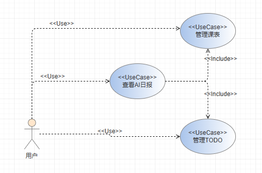
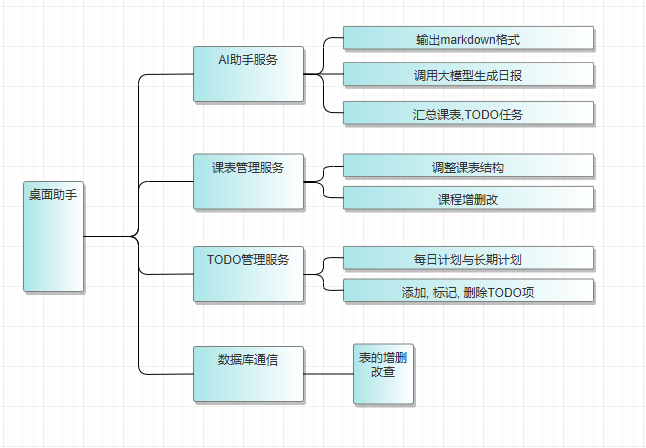
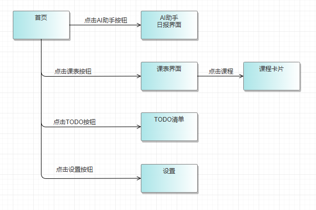

# 1. 项目说明
## 1.1. 项目目标
结合AI的桌面学习生活助手. 在基本的课表, 待办清单等功能的基础上, 让AI在每天工作开始之时向您问候, 根据您的课表与TODO自动生成今日日报, 并提出合理的建议, 让您能快速的明确目标, 投入一天的学习工作.
## 1.2. 软硬件环境需求
跨平台, 且无需额外配置
## 1.3. 使用的关键技术
1. 版本控制:
	- Git
2. 数据存储:
	- EF框架 + Sqlite数据库
3. GUI: 有待讨论
	- UI框架: Avalonia
	- 模式: CommunityToolkit.Mvvm
4. 测试:
	- xUnit.
5. AI部分:
	- **TODO**

# 2. 需求分析
## 2.1. 系统用例

1. 查看AI日报
2. 管理课表
3. 管理TODO
## 2.2. 业务流程
**TODO**
# 3. 概要设计
## 3.1. 功能模块设计

## 3.2. 核心类图
**TODO**
# 4. 界面设计

